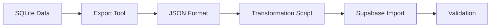
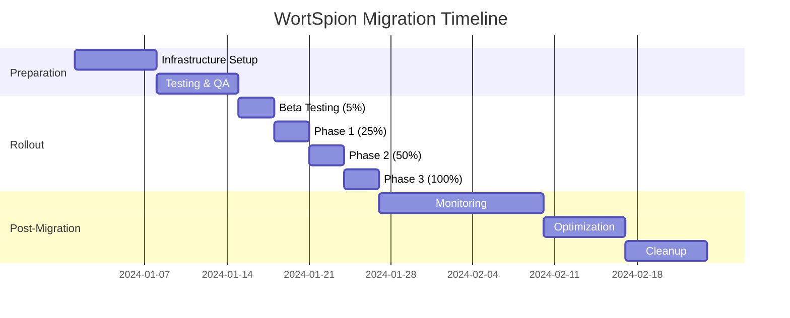

# Phase 9: Migration Checklist

This document provides a comprehensive checklist for migrating from the single-device version to the multiplayer version of WortSpion.

## Prerequisites

- [ ] Current app version backed up
- [ ] Database export completed
- [ ] User communications prepared
- [ ] Rollback plan ready
- [ ] Team briefed on migration process

## 1. Data Migration Planning

### 1.1 Data Inventory

```yaml
# Data to migrate
local_data:
  - player_groups
  - game_settings
  - word_database
  - statistics (optional)
  
# Data to preserve
preserve:
  - user_preferences
  - offline_mode_capability
  - existing_word_categories
  
# Data to transform
transform:
  - player_names_to_accounts
  - local_scores_to_profile_stats
```

### 1.2 Migration Strategy



## 2. Pre-Migration Tasks

### 2.1 Code Preparation
- [ ] Feature flags implemented for gradual rollout
- [ ] Backward compatibility layer added
- [ ] Migration scripts tested
- [ ] Rollback procedures verified

### 2.2 Infrastructure Setup
- [ ] Supabase production project configured
- [ ] Edge functions deployed
- [ ] Database schema created
- [ ] RLS policies enabled
- [ ] Monitoring configured

### 2.3 App Store Preparation
- [ ] Update descriptions mentioning multiplayer
- [ ] New screenshots prepared
- [ ] Privacy policy updated
- [ ] Terms of service updated

## 3. Migration Execution

### 3.1 Database Migration

#### Step 1: Export Existing Data
```dart
// lib/migration/export_tool.dart
class DataExporter {
  final SQLiteDatabase localDb;
  
  Future<MigrationData> exportData() async {
    final data = MigrationData();
    
    // Export player groups
    data.playerGroups = await localDb.query('player_groups');
    
    // Export game settings
    final prefs = await SharedPreferences.getInstance();
    data.settings = {
      'player_count': prefs.getInt('game_player_count'),
      'impostor_count': prefs.getInt('game_impostor_count'),
      'round_count': prefs.getInt('game_round_count'),
      'timer_duration': prefs.getInt('game_timer_duration'),
    };
    
    // Export statistics if available
    data.statistics = await localDb.query('game_statistics');
    
    return data;
  }
  
  Future<void> saveToFile(MigrationData data) async {
    final directory = await getApplicationDocumentsDirectory();
    final file = File('${directory.path}/wortspion_backup.json');
    await file.writeAsString(jsonEncode(data.toJson()));
  }
}
```

#### Step 2: Transform Data
```typescript
// migration/transform_data.ts
interface LocalPlayerGroup {
  id: string;
  name: string;
  players: string;
  created_at: number;
}

interface CloudPlayerGroup {
  id: string;
  user_id: string;
  name: string;
  players: string[];
  created_at: string;
}

function transformPlayerGroups(
  localGroups: LocalPlayerGroup[],
  userId: string
): CloudPlayerGroup[] {
  return localGroups.map(group => ({
    id: group.id,
    user_id: userId,
    name: group.name,
    players: JSON.parse(group.players),
    created_at: new Date(group.created_at).toISOString(),
  }));
}
```

#### Step 3: Import to Supabase
```typescript
// migration/import_to_supabase.ts
async function importData(data: MigrationData, userId: string) {
  const supabase = createClient(SUPABASE_URL, SUPABASE_SERVICE_KEY);
  
  // Import player groups
  if (data.playerGroups) {
    const transformed = transformPlayerGroups(data.playerGroups, userId);
    const { error } = await supabase
      .from('player_groups')
      .insert(transformed);
    
    if (error) throw error;
  }
  
  // Import user preferences
  if (data.settings) {
    const { error } = await supabase
      .from('user_preferences')
      .upsert({
        user_id: userId,
        preferences: data.settings,
        updated_at: new Date().toISOString(),
      });
    
    if (error) throw error;
  }
}
```

### 3.2 Feature Migration

#### Offline Mode Preservation
- [ ] Detect network availability
- [ ] Cache essential data locally
- [ ] Queue actions when offline
- [ ] Sync when connection restored

```dart
// lib/core/offline/offline_manager.dart
class OfflineManager {
  final LocalDatabase localDb;
  final SupabaseClient supabase;
  final Queue<OfflineAction> actionQueue = Queue();
  
  Future<void> executeAction(OfflineAction action) async {
    if (await isOnline()) {
      await action.execute(supabase);
    } else {
      await action.saveLocally(localDb);
      actionQueue.add(action);
    }
  }
  
  Future<void> syncOfflineActions() async {
    while (actionQueue.isNotEmpty && await isOnline()) {
      final action = actionQueue.removeFirst();
      try {
        await action.execute(supabase);
        await action.removeFromLocal(localDb);
      } catch (e) {
        actionQueue.addFirst(action); // Re-add on failure
        break;
      }
    }
  }
}
```

#### Settings Migration
- [ ] Map local preferences to user profile
- [ ] Preserve game defaults
- [ ] Migrate saved configurations

```dart
// lib/migration/settings_migrator.dart
class SettingsMigrator {
  static Future<void> migrateSettings(String userId) async {
    final prefs = await SharedPreferences.getInstance();
    final supabase = Supabase.instance.client;
    
    // Get all game settings
    final settings = <String, dynamic>{};
    for (final key in prefs.getKeys()) {
      if (key.startsWith('game_')) {
        settings[key] = prefs.get(key);
      }
    }
    
    // Save to user profile
    await supabase
        .from('user_profiles')
        .update({'default_settings': settings})
        .eq('id', userId);
    
    // Mark migration complete
    await prefs.setBool('settings_migrated', true);
  }
}
```

### 3.3 UI/UX Migration

#### Navigation Updates
- [ ] Add authentication flow
- [ ] Update menu structure
- [ ] Add mode selection
- [ ] Implement new screens

#### Component Updates
- [ ] Update player lists for online status
- [ ] Add connection indicators
- [ ] Implement real-time updates
- [ ] Add loading states

## 4. Testing Checklist

### 4.1 Functional Testing
- [ ] Local mode still works
- [ ] Authentication flow complete
- [ ] Room creation/joining works
- [ ] Game flow uninterrupted
- [ ] Voting synchronized
- [ ] Results calculated correctly

### 4.2 Migration Testing
- [ ] Data export successful
- [ ] Data import complete
- [ ] Settings preserved
- [ ] Player groups migrated
- [ ] No data loss

### 4.3 Performance Testing
- [ ] App launch time acceptable
- [ ] Memory usage stable
- [ ] Network usage optimized
- [ ] Battery impact minimal

### 4.4 Edge Cases
- [ ] Offline mode functional
- [ ] Reconnection handled
- [ ] Concurrent games supported
- [ ] Migration interruption recovery

## 5. Rollout Strategy

### 5.1 Phased Rollout

```yaml
phases:
  phase_1:
    percentage: 5%
    duration: 3 days
    features:
      - authentication
      - basic multiplayer
    monitoring:
      - error_rate
      - user_retention
      
  phase_2:
    percentage: 25%
    duration: 1 week
    features:
      - all_multiplayer_features
    monitoring:
      - performance_metrics
      - user_feedback
      
  phase_3:
    percentage: 50%
    duration: 1 week
    monitoring:
      - server_load
      - concurrent_games
      
  phase_4:
    percentage: 100%
    features:
      - full_release
```

### 5.2 Feature Flags

```dart
// lib/core/feature_flags.dart
class FeatureFlags {
  static bool get isMultiplayerEnabled {
    return RemoteConfig.instance.getBool('multiplayer_enabled');
  }
  
  static bool get isAuthRequired {
    return RemoteConfig.instance.getBool('auth_required');
  }
  
  static bool get showMultiplayerPromo {
    return RemoteConfig.instance.getBool('show_multiplayer_promo');
  }
  
  static int get multiplayerRolloutPercentage {
    return RemoteConfig.instance.getInt('multiplayer_rollout_percentage');
  }
  
  static bool shouldEnableMultiplayer(String userId) {
    final hash = userId.hashCode.abs();
    final percentage = hash % 100;
    return percentage < multiplayerRolloutPercentage;
  }
}
```

## 6. User Communication

### 6.1 In-App Messages

```dart
// lib/widgets/migration_announcement.dart
class MigrationAnnouncement extends StatelessWidget {
  @override
  Widget build(BuildContext context) {
    return Card(
      color: Colors.blue[50],
      child: Padding(
        padding: EdgeInsets.all(16),
        child: Column(
          crossAxisAlignment: CrossAxisAlignment.start,
          children: [
            Row(
              children: [
                Icon(Icons.celebration, color: Colors.blue),
                SizedBox(width: 8),
                Text(
                  'Neu: Multiplayer-Modus!',
                  style: Theme.of(context).textTheme.titleLarge,
                ),
              ],
            ),
            SizedBox(height: 8),
            Text(
              'Spiele jetzt mit Freunden auf ihren eigenen Geräten! '
              'Erstelle einen Raum und teile den Code.',
            ),
            SizedBox(height: 16),
            Row(
              mainAxisAlignment: MainAxisAlignment.end,
              children: [
                TextButton(
                  onPressed: () => _dismissAnnouncement(),
                  child: Text('Später'),
                ),
                ElevatedButton(
                  onPressed: () => _showMultiplayerIntro(),
                  child: Text('Ausprobieren'),
                ),
              ],
            ),
          ],
        ),
      ),
    );
  }
}
```

### 6.2 Email Template

```html
<!-- email_template.html -->
<!DOCTYPE html>
<html>
<head>
    <style>
        .container { max-width: 600px; margin: 0 auto; }
        .header { background: #4A90E2; color: white; padding: 20px; }
        .content { padding: 20px; }
        .feature { margin: 20px 0; }
        .cta { background: #4CAF50; color: white; padding: 15px 30px; text-decoration: none; display: inline-block; }
    </style>
</head>
<body>
    <div class="container">
        <div class="header">
            <h1>WortSpion - Jetzt mit Multiplayer!</h1>
        </div>
        <div class="content">
            <p>Liebe WortSpion-Spieler,</p>
            
            <p>Wir freuen uns, euch die größte Aktualisierung seit dem Launch zu präsentieren: 
            <strong>Der Multiplayer-Modus ist da!</strong></p>
            
            <div class="feature">
                <h3>🎮 Was ist neu?</h3>
                <ul>
                    <li>Spielt mit Freunden auf eigenen Geräten</li>
                    <li>Erstellt Räume mit einfachen Codes</li>
                    <li>Echtzeit-Synchronisation</li>
                    <li>Statistiken und Ranglisten</li>
                </ul>
            </div>
            
            <div class="feature">
                <h3>🎯 Was bleibt?</h3>
                <ul>
                    <li>Lokaler Modus weiterhin verfügbar</li>
                    <li>Keine Internetverbindung für Offline-Spiele nötig</li>
                    <li>Alle eure Einstellungen bleiben erhalten</li>
                </ul>
            </div>
            
            <p>
                <a href="https://wortspion.app/update" class="cta">Jetzt aktualisieren</a>
            </p>
            
            <p>Viel Spaß beim Spielen!<br>
            Euer WortSpion-Team</p>
        </div>
    </div>
</body>
</html>
```

## 7. Monitoring During Migration

### 7.1 Key Metrics

```typescript
// monitoring/migration_metrics.ts
export const migrationMetrics = {
  // User adoption
  multiplayerAdoptionRate: {
    query: `
      SELECT 
        COUNT(DISTINCT user_id) FILTER (WHERE game_mode = 'multiplayer') * 100.0 / 
        COUNT(DISTINCT user_id) as adoption_rate
      FROM game_sessions
      WHERE created_at > NOW() - INTERVAL '24 hours'
    `,
    threshold: 10, // Expect 10% adoption in first week
  },
  
  // Migration success
  migrationSuccessRate: {
    query: `
      SELECT 
        COUNT(*) FILTER (WHERE status = 'success') * 100.0 / COUNT(*) as success_rate
      FROM migration_logs
      WHERE created_at > NOW() - INTERVAL '1 hour'
    `,
    threshold: 95,
  },
  
  // Performance impact
  averageLoadTime: {
    query: `
      SELECT AVG(load_time_ms) 
      FROM app_performance 
      WHERE version >= '2.0.0' 
      AND created_at > NOW() - INTERVAL '1 hour'
    `,
    threshold: 3000, // Max 3 seconds
  },
  
  // Error rates
  authErrorRate: {
    query: `
      SELECT 
        COUNT(*) FILTER (WHERE error_type = 'auth') * 100.0 / COUNT(*) 
      FROM error_logs
      WHERE created_at > NOW() - INTERVAL '1 hour'
    `,
    threshold: 1,
  },
};
```

### 7.2 Migration Dashboard

```dart
// lib/admin/migration_dashboard.dart
class MigrationDashboard extends StatelessWidget {
  @override
  Widget build(BuildContext context) {
    return StreamBuilder<MigrationStats>(
      stream: MigrationMonitor.statsStream,
      builder: (context, snapshot) {
        if (!snapshot.hasData) {
          return CircularProgressIndicator();
        }
        
        final stats = snapshot.data!;
        
        return GridView.count(
          crossAxisCount: 2,
          children: [
            _MetricCard(
              title: 'Users Migrated',
              value: '${stats.usersMigrated}',
              total: stats.totalUsers,
              icon: Icons.person,
            ),
            _MetricCard(
              title: 'Adoption Rate',
              value: '${stats.adoptionRate.toStringAsFixed(1)}%',
              trend: stats.adoptionTrend,
              icon: Icons.trending_up,
            ),
            _MetricCard(
              title: 'Active Games',
              value: '${stats.activeGames}',
              subtitle: '${stats.multiplayerGames} multiplayer',
              icon: Icons.games,
            ),
            _MetricCard(
              title: 'Error Rate',
              value: '${stats.errorRate.toStringAsFixed(2)}%',
              status: stats.errorRate < 1 ? 'good' : 'warning',
              icon: Icons.error_outline,
            ),
          ],
        );
      },
    );
  }
}
```

## 8. Post-Migration Tasks

### 8.1 Cleanup
- [ ] Remove migration code after 30 days
- [ ] Archive old data formats
- [ ] Update documentation
- [ ] Remove feature flags

### 8.2 Optimization
- [ ] Analyze usage patterns
- [ ] Optimize frequently used queries
- [ ] Review and adjust caching
- [ ] Fine-tune real-time subscriptions

### 8.3 User Feedback
- [ ] Collect migration feedback
- [ ] Address common issues
- [ ] Update FAQ
- [ ] Plan improvements

## 9. Rollback Procedures

### 9.1 Immediate Rollback (< 24 hours)
```bash
# 1. Disable multiplayer feature flag
firebase remoteconfig:set multiplayer_enabled false

# 2. Revert app store builds
# Android: Upload previous AAB with higher version code
# iOS: Expedite review for previous version

# 3. Restore database
supabase db reset --project-ref prod-ref
pg_restore -d postgresql://... backup.sql
```

### 9.2 Partial Rollback (> 24 hours)
```typescript
// Keep multiplayer but disable new features
async function partialRollback() {
  // Disable new user registrations
  await supabase.rpc('toggle_new_registrations', { enabled: false });
  
  // Limit to existing multiplayer users
  await remoteConfig.set('multiplayer_whitelist_only', true);
  
  // Increase monitoring
  await monitoring.setAlertThreshold('error_rate', 0.5);
}
```

## 10. Success Criteria

### Technical Success
- [ ] < 1% error rate increase
- [ ] < 500ms latency increase
- [ ] > 95% migration success rate
- [ ] < 5% crash rate increase

### Business Success
- [ ] > 20% multiplayer adoption in 30 days
- [ ] > 80% user retention
- [ ] > 4.0 app store rating maintained
- [ ] < 10% support ticket increase

### User Experience Success
- [ ] Seamless upgrade experience
- [ ] No data loss reports
- [ ] Positive user feedback
- [ ] Increased engagement metrics

## Migration Timeline



## Next Steps

1. Begin pre-migration tasks
2. Set up monitoring dashboard
3. Prepare user communications
4. Proceed to [Progress Tracker](./10-progress-tracker.md)
